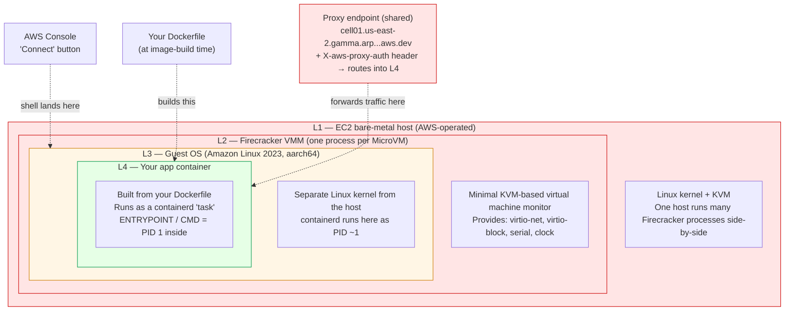
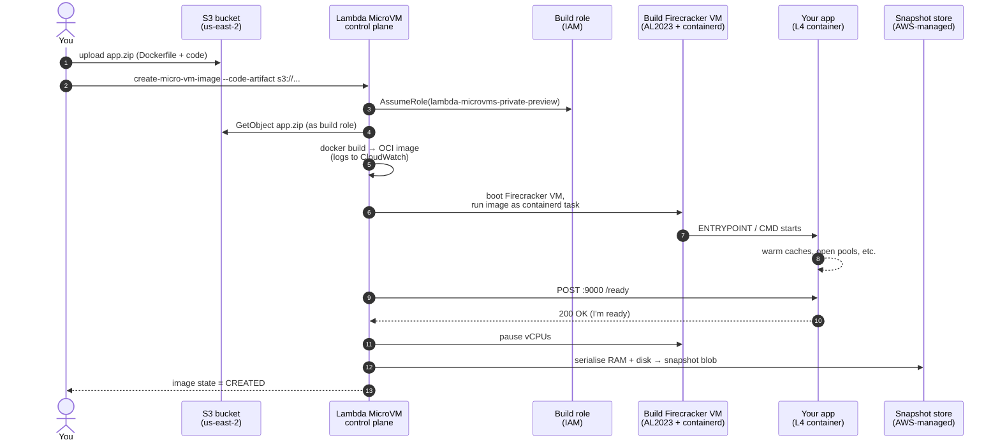
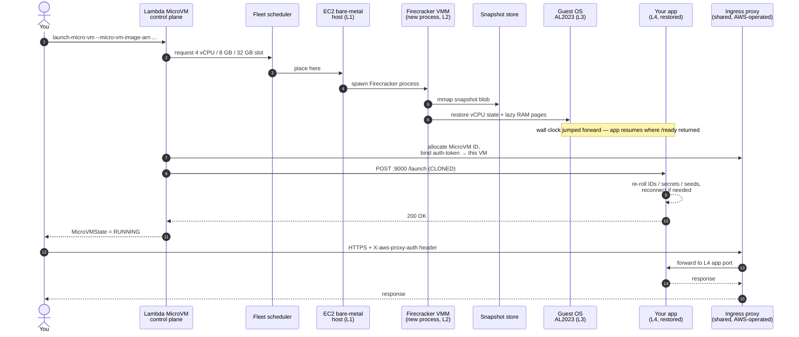
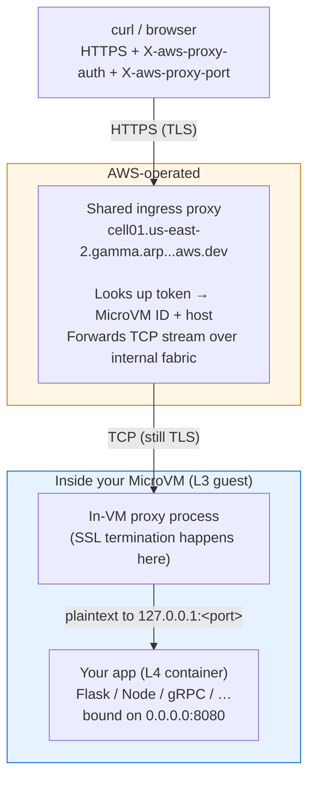
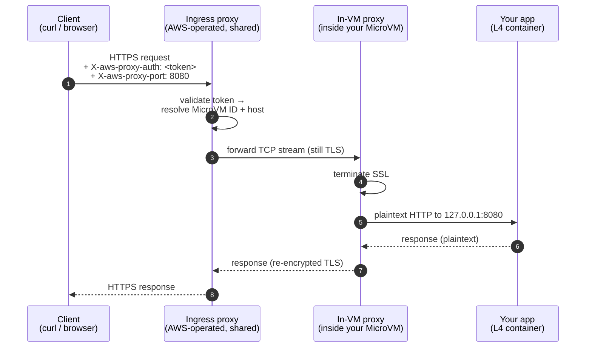

# Lambda MicroVM Architecture

A walkthrough of *how* a Lambda MicroVM is actually put together — from the
bare-metal host up to your Python/Node/Rust process — and where the
boundary between "AWS owns it" and "you own it" falls.

Paired with [`HOWTO.md`](./HOWTO.md), which covers the runtime *state
machine* (launch / suspend / resume / terminate). Read this one first for
the anatomy, then that one for the dynamics.

> ⚠️ **Disclaimer — read before trusting this doc**
>
> Lambda MicroVMs is in **private preview** at the time of writing
> (2026-04-24). Both the service's public behavior *and* my model of its
> internals may be inaccurate, incomplete, or wrong:
>
> - **The service is changing.** AWS can alter the API surface,
>   scheduler behavior, device model, proxy topology, or hook semantics
>   without notice during preview. Treat every specific claim as
>   "true as of today, maybe not tomorrow."
> - **Not all claims are equally grounded.** Roughly 60% of this doc is
>   traceable to the AWS Developer Guide, `HOWTO.md`, or the service
>   model JSON shipped in this repo. The remaining ~40% is a mix of
>   general Firecracker / KVM / containerd knowledge and *educated
>   inferences* about how AWS composes those pieces. I've tried to mark
>   the inferred parts inline, but I may have missed some.
> - **Author is a Datadog engineer, not an AWS insider.** This is a
>   reverse-engineered mental model built from public docs + hands-on
>   experimentation. Where AWS's internal implementation differs from
>   what I've drawn, AWS wins and this doc is wrong.
> - **Preview-only endpoints and ARNs appear throughout.** URLs like
>   `cell01.us-east-2.gamma...` and the `lambda-microvms-al2023-1` base
>   image ARN are expected to change at GA.
>
> If you spot something wrong, please correct it in place and keep
> moving — this doc is meant to be a living artifact, not a spec.

---

## The layered stack

The thing you think of as "my MicroVM" is actually four nested execution
environments. From bottom to top:

```
 ┌────────────────────────────────────────────────────────────────────┐
 │  L1 ── EC2 bare-metal host (AWS-operated)                          │
 │        Linux kernel + KVM                                          │
 │        One host runs many Firecracker processes side-by-side.      │ ◄── YOU
 │                                                                    │     CANNOT
 │   ┌──────────────────────────────────────────────────────────┐     │     SEE OR
 │   │  L2 ── Firecracker VMM (one process per MicroVM)         │     │     TOUCH
 │   │        Minimal KVM-based virtual machine monitor.        │     │     THIS
 │   │        Provides: virtio-net, virtio-block, serial, clock.│     │
 │   │                                                          │     │
 │   │   ┌────────────────────────────────────────────────┐     │     │
 │   │   │  L3 ── Guest OS  (Amazon Linux 2023, aarch64)  │◄────┼─────┼── shell via
 │   │   │        Separate Linux kernel from the host.    │     │     │   Console
 │   │   │        containerd runs here as PID ~1.         │     │     │   "Connect"
 │   │   │                                                │     │     │   lands here
 │   │   │   ┌───────────────────────────────────────┐    │     │     │
 │   │   │   │  L4 ── Your app container             │◄───┼─────┼─────┼── Dockerfile
 │   │   │   │        Built from your Dockerfile.    │    │     │     │   builds this
 │   │   │   │        Runs as a containerd "task".   │    │     │     │
 │   │   │   │        ENTRYPOINT/CMD = PID 1 inside. │    │     │     │
 │   │   │   └───────────────────────────────────────┘    │     │     │
 │   │   └────────────────────────────────────────────────┘     │     │
 │   └──────────────────────────────────────────────────────────┘     │
 └────────────────────────────────────────────────────────────────────┘
                                  ▲                                    
                                  │                                    
         Proxy endpoint (shared) ─┘                                    
 https://cell01.us-east-2.gamma.arp.kepler-analytics.aws.dev           
   + X-aws-proxy-auth header → routes into *your* MicroVM's L4.        
```

Same layering as a Mermaid flowchart with nested subgraphs (renders on
GitHub / Confluence / Obsidian):



Legend: 🟥 red = AWS-operated, you cannot see or touch. 🟧 orange =
shared, you get a constrained shell view. 🟩 green = fully yours.

Two things worth calling out:

- **"Host OS" is an overloaded term.** AWS's Developer Guide says *"the
  MicroVM shell places you on the MicroVM host OS"* — but that's **L3**,
  the Amazon Linux *guest*. The true host (L1) is EC2 bare metal you
  never see. When you run `ctr task ls` from that shell, you're using the
  guest's containerd to find the task that is your app (L4).
- **Every layer boundary is enforced by a different mechanism.** L1→L2 is
  KVM hardware virtualization. L2→L3 is the Firecracker virtio device
  model (no paravirt drivers = no escape surface). L3→L4 is containerd's
  namespace/cgroup isolation. Three walls between tenant apps on the
  same physical box.

---

## How the underlying host is created

Short answer: **you don't.** L1 is entirely AWS-managed. From a developer
perspective, the host is a pool — when you call `launch-micro-vm`, the
control plane picks *some* host in the `us-east-2` cell that has spare
capacity for a 4 vCPU / 8 GB / 32 GB slot and places your Firecracker
process there. You can't pin, inspect, or address a specific host.

What AWS does at L1 (observable only through side effects):

1. Bootstraps a fleet of bare-metal EC2 instances running a hardened
   Linux + KVM + a Firecracker binary.
2. Runs a scheduler that matches incoming launch requests against hosts
   with free vCPU / RAM / disk budget.
3. Wires the per-host networking fabric into the shared ingress proxy
   (`cell01.us-east-2.gamma.arp.kepler-analytics.aws.dev`).

The only contract you can rely on: **4 vCPU / 8 GB / 32 GB per MicroVM,
ARM64, us-east-2, no two MicroVMs share a Firecracker process.**

---

## How a MicroVM Image is built (the one-time snapshot)

This is the `create-micro-vm-image` flow. It takes your zip and produces
an immutable Firecracker snapshot.

```
   You                        AWS Build pipeline                          Result
   ───                        ─────────────────                           ──────

   zip (Dockerfile + code)
          │
          ▼
    S3 bucket ───────►  (1) Download zip using build-role
                                    │
                                    ▼
                        (2) Run Dockerfile → OCI image
                            (CloudWatch logs stream to
                             /aws/lambda/microvms/<image-name>)
                                    │
                                    ▼
                        (3) Boot a fresh Firecracker VM:
                              - AL2023 guest kernel
                              - containerd starts
                              - your image runs as
                                a containerd task
                                    │
                                    ▼
                        (4) Platform POSTs to port 9000:
                              POST /aws/lambda-microvms/
                                   runtime/beta/v1/ready
                            — your app says "I'm up, 200 OK"
                                    │
                                    ▼
                        (5) Firecracker snapshot:
                              - pause vCPUs
                              - serialise RAM pages
                              - freeze disk state      ─────────►  Immutable
                              - write to AWS-managed                MicroVM Image
                                snapshot store                      (Firecracker
                                                                    snapshot blob)
```

Same flow as a Mermaid sequence diagram (renders on GitHub / Confluence /
Obsidian):



Key observations that are **not** obvious from the CLI:

- **Step 3 happens inside Firecracker**, not in a plain Docker build
  host. That's why your Dockerfile's `CMD`/`ENTRYPOINT` actually runs
  during image build — it has to, because step 5 captures the running
  memory. If your app crashes during startup, the image never reaches
  `CREATED`.
- **The `/ready` hook is your only control over *when* the snapshot is
  taken.** Return 200 too early → snapshot captures a half-warmed cache.
  Return 200 after priming → every launch starts pre-warm. This is the
  entire point of the feature, and it's easy to miss.
- **Snapshots are shared.** Every MicroVM launched from this image gets
  a byte-identical copy of RAM at step 5. That's why CLAUDE.md bans
  generating IDs / secrets / seeds at build time.
- **Updating is impossible.** During preview, you create a *new* image
  with a new name and point a new launch at it. There is no
  `update-micro-vm-image`.

---

## How a MicroVM is started (snapshot clone + launch hook)

`launch-micro-vm` does **not** boot an OS. It restores a snapshot.

```
  launch-micro-vm API call
             │
             ▼
   (1) Scheduler picks a host with free capacity.
             │
             ▼
   (2) Firecracker process starts on that host:
         - loads the snapshot blob
         - maps guest RAM pages lazily (copy-on-write from snapshot)
         - resumes the pre-captured vCPU state
             │
             ▼
   (3) Guest "wakes up" mid-execution — clock has jumped forward,
       your app process is exactly where /ready returned 200.
             │
             ▼
   (4) Platform wires ingress:
         - allocates a unique MicroVM ID
         - binds ingress connector (default: ports 80, 443 open)
         - proxy endpoint accepts X-aws-proxy-auth <token> → this VM
             │
             ▼
   (5) Platform POSTs to port 9000:
         POST /aws/lambda-microvms/runtime/beta/v1/launch
       — your /launch hook handler runs. Regenerate any unique
         state here (IDs, secrets, seeds). Reconnect if needed.
             │
             ▼
   (6) MicroVMState = RUNNING. Traffic flows.
```

Same flow as a Mermaid sequence diagram:



Why this is fast: step 2 is memory-mapped from the snapshot, not
allocated + paged in. Guide quote: *"1 second for every 500 MB of
snapshotted state."* That scales with *used* RAM, not image size — a 2 GB
snapshot where only 500 MB is live pages launches in ~1 s.

The corresponding flow for `/resume` (in-place wake from suspend) is
structurally similar but the Firecracker process is the *same one* —
memory never left the host, just paused. That's why in-memory state
survives across suspend/resume but not across clones. See `HOWTO.md` for
the full state-machine view.

---

## Ingress data path

Worth diagramming on its own because the proxy model is unusual:

```
  curl / browser
       │
       │   HTTPS +
       │   X-aws-proxy-auth: <token>
       │   X-aws-proxy-port: 8080   (optional; default 443→8080)
       ▼
  ┌─────────────────────────────────────────┐
  │  Shared ingress proxy (AWS-operated)    │
  │  cell01.us-east-2.gamma.arp...aws.dev   │
  │                                         │
  │  Looks up token → MicroVM ID + host.    │
  │  Forwards the TCP stream over the       │
  │  internal network fabric.               │
  └───────────────────┬─────────────────────┘
                      │
                      ▼
  ┌─────────────────────────────────────────┐
  │  Inside your MicroVM (L3 guest)         │
  │                                         │
  │   ┌───────────────────────────────┐     │
  │   │  In-VM proxy process          │     │
  │   │  terminates SSL here          │     │
  │   └────────────┬──────────────────┘     │
  │                │ plaintext to           │
  │                │ 127.0.0.1:<port>       │
  │                ▼                        │
  │   ┌───────────────────────────────┐     │
  │   │  Your app (L4 container)      │     │
  │   │  Flask / Node / gRPC / …      │     │
  │   │  bound on 0.0.0.0:8080        │     │
  │   └───────────────────────────────┘     │
  └─────────────────────────────────────────┘
```

Same picture as a Mermaid flowchart (renders on GitHub / Confluence /
Obsidian):



And here's what happens on a single request as a sequence diagram —
useful for seeing *where* TLS lives and *where* the plaintext hop is:



Implications that shape app design:

- **Your app doesn't handle TLS.** SSL termination is inside the VM but
  *before* your process. You get plaintext on whatever port you expose.
  (The guide hints you *can* put TLS on your own port too and the proxy
  will re-encrypt, but that's extra work for no security benefit.)
- **The auth token is coarse-grained.** It names a MicroVM, not a user.
  If you need per-user auth, layer it on top inside your app.
- **Browsers can't set `X-aws-proxy-auth` for WebSockets.** Use the
  `Sec-Websocket-Protocol` subprotocol trick (see the developer guide or
  `nodejs-grpc-example/`).
- **Port 9000 is reserved** for the platform → your app lifecycle-hook
  channel. Don't expose it as ingress — the proxy won't route outside
  traffic to it anyway, but binding your user traffic there collides
  with the hook handler.

---

## What you can touch, what you can't

| Layer | Under your control? | How you control it |
|-------|---------------------|--------------------|
| L1 EC2 bare-metal host | ❌ No | AWS-operated. Fleet-scheduled; you can't pin. |
| L2 Firecracker VMM | ❌ No | Version, config, devices are fixed by the platform. |
| L3 Guest kernel (AL2023) | ❌ Not really | Base image ARN picks the kernel. One option during preview: `lambda-microvms-al2023-1`. |
| L3 Guest userspace | ⚠️ Partial | containerd + platform agents are fixed, but you share the mount namespace of the guest. Shell is read-only-ish in practice. |
| L4 Container filesystem | ✅ Yes | Your Dockerfile defines it completely. |
| L4 App processes | ✅ Yes | Whatever `CMD`/`ENTRYPOINT` launches. Includes any sidecars (DD agent, serverless-init, etc.). |
| Lifecycle hooks (port 9000) | ✅ Yes | Implement the 5 endpoints. See `lifecycle_hooks_openapi.json`. |
| Ingress ports | ✅ Yes | `--ingress-network-connectors` at launch; default = 80/443 → 8080. |
| Egress mode | ✅ Yes | `INTERNET_EGRESS`, `NO_EGRESS`, or (future) VPC. |
| Idle / auto-resume policy | ✅ Yes | `--idle-policy` at launch. |
| IAM (build + exec roles) | ✅ Yes | `--build-role-arn` at image create; execution role at launch. |
| Per-MicroVM auth tokens | ✅ Yes | `generate-micro-vm-auth-token` with expiry. |
| Snapshot timing (the `/ready` moment) | ✅ Yes | Your `/ready` handler decides when the snapshot gets taken. |
| Snapshot contents | ❌ No | Opaque Firecracker blob. Can't edit, export, or mount. |
| Host-level observability (CPU steal, neighbour noise) | ❌ No | Not exposed. |

---

## Minimum mental model

If you internalize nothing else, internalize this:

> **A MicroVM Image is a paused Firecracker VM.
>  A MicroVM is that VM resumed and connected to a proxy.**

- `create-micro-vm-image` = boot a VM, let your app warm up, press pause,
  save the paused VM to disk.
- `launch-micro-vm` = copy that paused VM, press play on the copy, wire
  the proxy to it.
- `/resume` = press play on an existing paused VM (same memory, same
  connections — now stale).
- `/launch` = press play on a *fresh copy* (same memory, but it's a new
  clone, so re-roll unique state).
- `/terminate` = discard the VM. Memory and disk go with it.

Everything else — the Dockerfile, the hook endpoints, the auth token
flow, the idle policy — is plumbing around that core idea.
