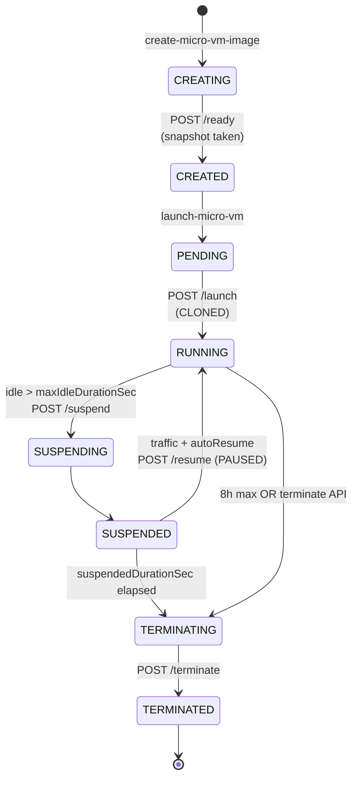
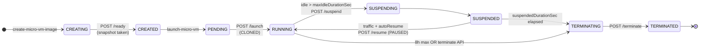

# Lambda MicroVM HOWTO

## Lifecycle hook state machine

Distilled from `MicroVMState` (see `lambdamicrovms-2025-09-09.json` lines 2855–2865),
`lifecycle_hooks_openapi.json`, the `sample-flask-app/app.py` comments
(CLONED vs PAUSED), and the idle-policy defaults in `deploy-microvm.sh`.

The key thing to understand upfront: **all 5 hooks are platform→app HTTP
POSTs to port 9000 of the guest**. The platform makes the call; your app
responds `200` when the transition-work is done.

There are two distinct phases with their own state machines.

### Phase 1 — Image build (one-time, at `create-micro-vm-image`)

```
 create-micro-vm-image API
         │
         ▼
   ┌──────────┐       POST /ready         ┌────────────┐
   │ CREATING │──────────────────────────►│  CREATED   │
   │ (image)  │   app startup complete    │  (image)   │
   └──────────┘   → platform takes        └─────┬──────┘
                    Firecracker snapshot        │
                    after 200 response          │
                                                ▼
                                         launch-micro-vm
                                         API takes over
```

`/ready` fires exactly once per image, inside the build container. It's the
app's signal to the build pipeline that it's up; only then does Firecracker
snapshot the VM memory.

### Phase 2 — Runtime (per MicroVM instance, from the `MicroVMState` enum)

```
  launch-micro-vm API
          │
          ▼
    ┌──────────┐   POST /launch     ┌────────────┐
    │ PENDING  │──(CLONED, from────►│  RUNNING   │◄──────┐
    └──────────┘   snapshot)        └─────┬──────┘       │
                                          │              │
              idle > maxIdleDurationSec   │              │ POST /resume
              → POST /suspend             │              │ (PAUSED, in-place wake)
                                          ▼              │
                                   ┌────────────┐        │
                                   │ SUSPENDING │        │
                                   │ (transient)│        │
                                   └─────┬──────┘        │
                                         │               │
                                         ▼               │
                                   ┌────────────┐        │
                                   │ SUSPENDED  │────────┤ (traffic arrives
                                   └─────┬──────┘        │  AND autoResumeEnabled)
                                         │               │
                   suspendedDurationSec  │               │
                   elapsed, OR 8h max    │               │
                   lifetime, OR explicit │               │
                   terminate API         │               │
                                         ▼               │
                                   ┌────────────┐        │
  RUNNING ───────────8h max───────►│TERMINATING │◄───────┘
                                   └─────┬──────┘
                                         │ POST /terminate
                                         ▼    (fire-and-move-on,
                                   ┌────────────┐ 60s timeout)
                                   │ TERMINATED │
                                   └────────────┘
                                    (final)
```

### Hook → transition summary

| Hook | Fires when platform is transitioning … | Resume type | Your app should… | Timeout |
|------|-----------------------------------------|-------------|-------------------|---------|
| `/ready` | *(image-build)* app has booted inside the build container, before snapshot | — | Respond `200` once routes are live; don't do work that mutates per-instance state | 60m |
| `/launch` | `PENDING → RUNNING` on a fresh snapshot clone | **CLONED** | Re-roll any unique state (IDs, secrets, seeds) — every cloned VM starts from the same snapshot | 60m |
| `/suspend` | `RUNNING → SUSPENDING → SUSPENDED` after idle exceeds `maxIdleDurationSeconds` | — | Gracefully close DB / outbound connections; they'll be dead when you wake | 120s |
| `/resume` | `SUSPENDED → RUNNING` on in-place wake (traffic or autoResume) | **PAUSED** | Reopen the connections you closed in `/suspend`; clock has jumped forward | 120s |
| `/terminate` | `{any} → TERMINATING → TERMINATED` | — | Flush metrics/logs — after `200` (or 60s), the VM is gone | 60s |

### Things worth knowing

- **CLONED vs PAUSED is the most important distinction.** Every `/launch` is
  a fresh snapshot clone — state from the image's memory is *shared* across
  every MicroVM that ever launches from it. `/resume` is the *same* VM
  waking up, so in-memory state survives (but wall-clock time and connection
  state don't). This is why CLAUDE.md's *Snapshot Uniqueness* section is
  strict about not generating IDs/secrets at build time — they'd be
  identical across every clone. Generate them in `/launch`.
- **Idle is measured by endpoint traffic, not CPU.** A MicroVM that's 100%
  CPU-busy doing batch work but gets no HTTP requests will still hit
  `/suspend` — a foot-gun for async workloads. For those, either disable
  `autoResumeEnabled` or set `maxIdleDurationSeconds` generously.
  `deploy-microvm.sh` currently hardcodes 900s (15 min), which is fine for
  serving workloads but wrong for schedulers.
- **The three timeouts tell you how expensive each hook's work is expected
  to be.** `/ready` and `/launch` get 60 minutes because they can do
  heavyweight warm-up (migrations, cache priming). `/suspend` and `/resume`
  get 120s — just enough to close/reopen connections. `/terminate` gets
  only 60s — flush, don't fight. If a hook starts approaching its timeout
  in prod, that's a strong signal to move the work elsewhere.

### Mermaid version

Drop this into any Markdown renderer that supports Mermaid (GitHub,
Confluence, Obsidian):



Same diagram, left-to-right layout — useful when embedding in a wide page
(Confluence, a dashboard) where vertical space is tight and horizontal
space is plentiful:



## Listing MicroVM images and instances

`awsv` = AWS CLI v2. All commands need `--region`. The `--endpoint` shown
below targets the **gamma (preview)** control plane — **omit `--endpoint`
entirely to hit production**, now that the service is GA (the CLI resolves
`https://lambda.<region>.amazonaws.com` from the service model). Note that
gamma and prod are separate environments: resources created in one are not
visible in the other.

Operation naming is asymmetric: images are `list-microvm-images` (hyphenated),
instances are `list-microvms` (no hyphen). Both return results under `items[]`.

### MicroVM images

```bash
awsv aws lambda-microvms list-microvm-images \
  --region us-east-2 \
  --endpoint https://cell01.us-east-2.gamma.fe.kepler-analytics.aws.dev
```

Readable table (name / state / version / ARN):

```bash
awsv aws lambda-microvms list-microvm-images \
  --region us-east-2 \
  --endpoint https://cell01.us-east-2.gamma.fe.kepler-analytics.aws.dev \
  --query 'items[].{name:name,state:state,version:latestActiveImageVersion,arn:imageArn}' \
  --output table
```

### MicroVM instances

```bash
awsv aws lambda-microvms list-microvms \
  --region us-east-2 \
  --endpoint https://cell01.us-east-2.gamma.fe.kepler-analytics.aws.dev
```

Readable table (id / state / endpoint / image), excluding terminated VMs (they
linger in the list indefinitely):

```bash
awsv aws lambda-microvms list-microvms \
  --region us-east-2 \
  --endpoint https://cell01.us-east-2.gamma.fe.kepler-analytics.aws.dev \
  --query "items[?state!='TERMINATED'].{id:microvmId,state:state,endpoint:endpoint,image:imageArn}" \
  --output table
```

### Production (GA) — omit `--endpoint`

Same commands with no `--endpoint`; the CLI resolves the prod endpoint
(`https://lambda.us-east-2.amazonaws.com`) from the service model. Use these to
see what exists in **production** (a different environment than gamma above):

```bash
# Images in prod
awsv aws lambda-microvms list-microvm-images --region us-east-2

# Instances in prod
awsv aws lambda-microvms list-microvms --region us-east-2

# Prod, readable tables
awsv aws lambda-microvms list-microvm-images --region us-east-2 \
  --query 'items[].{name:name,state:state,version:latestActiveImageVersion,arn:imageArn}' \
  --output table

awsv aws lambda-microvms list-microvms --region us-east-2 \
  --query "items[?state!='TERMINATED'].{id:microvmId,state:state,endpoint:endpoint,image:imageArn}" \
  --output table
```

> Avoid `sort_by(items, &createdAt)` in `--query` — it throws if any item has a
> null sort key. Sort client-side after `--output json` instead.
