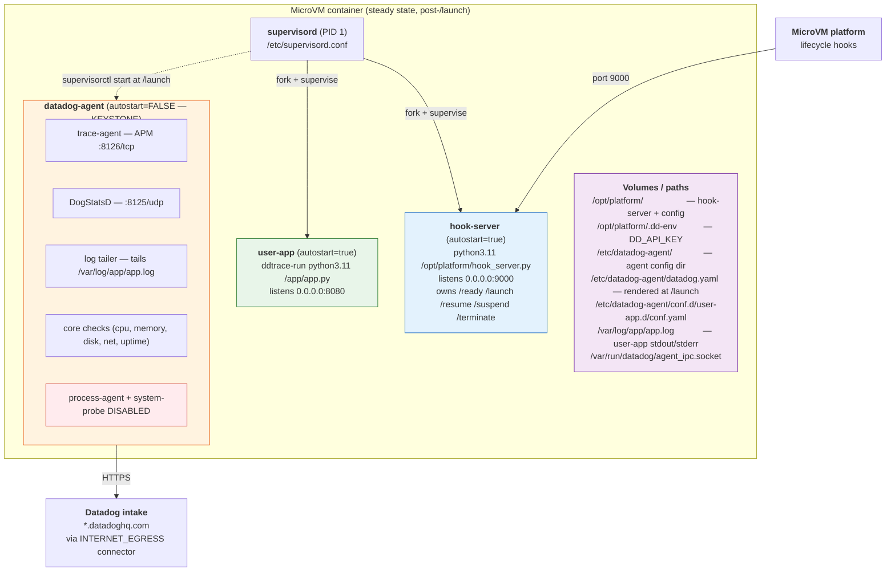
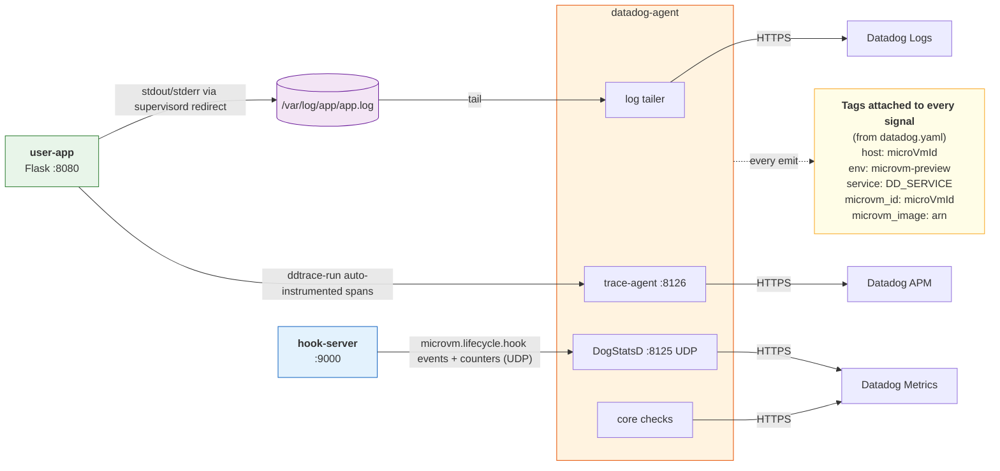
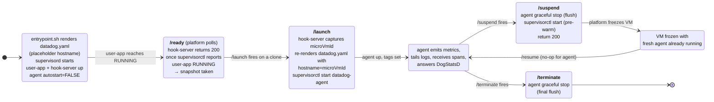

# Observability with the Full Datadog Agent on Lambda MicroVM

A design walkthrough of `sample-flask-app-datadog-agent-poc/` — the
proof-of-concept that runs the unmodified, upstream `datadog-agent`
inside a Firecracker-backed Lambda MicroVM, serving full observability
(APM, logs, DogStatsD, host-infra metrics, lifecycle events) to a user
application **without requiring any changes to that application's code.**

Companion docs:

- [`HOWTO-DATADOG-AGENT.md`](../HOWTO-DATADOG-AGENT.md) — build/run
  instructions, file-by-file reference, multi-language adaptations
- [`IMAGE-SIZE-COMPARISON.md`](../IMAGE-SIZE-COMPARISON.md) — measured
  image weight relative to serverless-init / serverless-compat
- [`PREVIEW-CAVEATS.md`](../PREVIEW-CAVEATS.md) — tracked gaps in the
  MicroVM preview service
- [`HOWTO.md`](../HOWTO.md) — the lifecycle state machine this design
  plugs into

This doc is the **design-and-verdict** layer: what we built, why the
design looks like it does, what it costs, and when to use it.

---

## TL;DR

The full Datadog Agent can be made to run inside a Lambda MicroVM with
zero user-code change, but **it's architecturally mismatched** for the
ephemeral, snapshot-cloned, suspend/resume-driven runtime. Every piece
of glue in the POC exists because the Agent was designed around a
"long-lived host" mental model, and MicroVM is a "fleet of ephemeral
clones from a shared snapshot" model. Bridging those takes ~500 lines
of platform infrastructure code, a ~3× image-size increase over
`serverless-init`, and acceptance of non-standard adapters that the
Datadog team doesn't have a supported contract for.

**Verdict: use `serverless-init` or `serverless-compat` instead, unless
you have a concrete requirement that only the full Agent satisfies.**
Full detail in [§ Verdict](#verdict).

> **Language caveat on "zero user code change":** holds for APM
> auto-instrumentation on Python, Node.js, Java, Ruby, .NET, and PHP —
> the tracer attaches via either a command-line wrapper or environment
> variables, never touching user source. **Go is the one exception** —
> `dd-trace-go` statically links into the user binary, so Go user-apps
> need a ~5-line source change to `main.go`. This is NOT
> MicroVM-specific; it affects full-agent, `serverless-init`, and
> `serverless-compat` equally. See [§ Trade-off 7](#7-apm-auto-instrumentation-go-is-the-one-language-exception).

---

## What "observability" means here

Five signal types, each on its own transport and delivery path. This
matters for the rest of the design because the signals have different
durability guarantees and different failure modes.

| Signal | Transport | Produced by | Agent role |
|--------|-----------|-------------|------------|
| **APM traces** | TCP `localhost:8126` | `ddtrace-run` wrapping the user command | trace-agent subprocess receives, buffers, ships |
| **Logs** | File tail | user-app stdout/stderr → `/var/log/app/app.log` | Log integration tails the file, ships lines |
| **DogStatsD metrics + events** | UDP `localhost:8125` | hook-server's lifecycle events; user-app custom metrics (opt-in) | DogStatsD listener receives, aggregates, ships |
| **Host-infra metrics** (CPU, mem, disk, net) | Agent-internal | Agent's core checks | Emitted every ~15 s while agent is running |
| **Hostname identity** | `datadog.yaml` `hostname:` field | hook-server writes at `/launch` time | Tagged on every other signal above |

All five end up at Datadog's intake tagged with the per-clone
`microvm_id` so a single MicroVM's full observability surface is
correlatable.

---

## Architecture

### Container process tree (steady state, post-`/launch`)

```
┌─────────────────────────── MicroVM CONTAINER ────────────────────────────┐
│                                                                          │
│  PID 1  supervisord  (/etc/supervisord.conf)                             │
│    │                                                                     │
│    ├── user-app        autostart=true                                    │
│    │     command:  ddtrace-run python3.11 /app/app.py                    │
│    │     listens:  0.0.0.0:8080  (user's HTTP surface)                   │
│    │     stdout/stderr → /var/log/app/app.log (file, rotated)            │
│    │                                                                     │
│    ├── hook-server     autostart=true                                    │
│    │     command:  python3.11 /opt/platform/hook_server.py               │
│    │     listens:  0.0.0.0:9000  (MicroVM platform → hook-server)        │
│    │     owns:     /ready  /launch  /resume  /suspend  /terminate        │
│    │                                                                     │
│    └── datadog-agent   autostart=FALSE  ← KEYSTONE (see §Trade-offs)     │
│           │             started by hook-server on /launch                │
│           │                                                              │
│           ├── trace-agent       (APM, listens on 8126/tcp)               │
│           ├── DogStatsD server  (listens on 8125/udp)                    │
│           ├── log tailer        (tails /var/log/app/app.log)             │
│           ├── core checks       (cpu, memory, disk, net, uptime, …)      │
│           └── (process-agent + system-probe DISABLED by datadog.yaml)    │
│                                                                          │
│  Volumes / paths of interest:                                            │
│    /opt/platform/                 hook-server + its config               │
│    /opt/platform/.dd-env          DD_API_KEY injected by deploy script   │
│    /etc/datadog-agent/            agent config dir                       │
│    /etc/datadog-agent/datadog.yaml              (re-rendered at /launch) │
│    /etc/datadog-agent/conf.d/user-app.d/conf.yaml  (log integration)     │
│    /var/log/app/app.log                         (user-app stdout/stderr) │
│    /var/run/datadog/agent_ipc.socket            (agent IPC socket)       │
│                                                                          │
└──────────────────────────────────────────────────────────────────────────┘
                 ▲                              │
                 │                              │
                 │ platform → port 9000         │  agent → *.datadoghq.com
                 │ (lifecycle hooks)            │  (intake, over HTTPS, via
                 │                              │   MicroVM's INTERNET_EGRESS
                 │                              │   network connector)
```

Same hierarchy in Mermaid:



### Per-signal data flow

```
  user-app (Flask, port 8080)  ───── HTTP req ──▶  (platform proxy)
       │                                                        │
       │ stdout/stderr (supervisord redirect_stderr=true)        │
       ▼                                                        │
  /var/log/app/app.log  ──(tail)──▶  log-agent  ──(HTTPS)───▶ Datadog Logs
       │                                                        │
       └─(ddtrace-run auto-instrumentation)──┐                  │
                                             ▼                  │
                                       localhost:8126           │
                                             │                  │
                                        trace-agent ──(HTTPS)──▶ Datadog APM
                                             ▲                  │
                                             │                  │
  hook-server (port 9000)                    │                  │
       │                                     │                  │
       │ DogStatsD events + counters         │                  │
       │ (microvm.lifecycle.hook, etc.)      │                  │
       ▼                                     │                  │
  localhost:8125 (UDP)                       │                  │
       │                                     │                  │
   DogStatsD listener ──(agent core)─────────┤                  │
                                             │                  │
   core checks (cpu/mem/disk) ───────────────┤                  │
                                             │                  │
                                    ─────────┴──(HTTPS)──▶ Datadog Metrics
                                                                │
                                                                │
  Agent's tag set (from datadog.yaml — attached to every signal):
    host:   <microVmId>         (the canonical hostname)
    env:    microvm-preview
    service: <DD_SERVICE>        (from Dockerfile ENV)
    microvm_id:    <microVmId>
    microvm_image: <arn>
```

Same flow in Mermaid:



### Agent lifecycle across MicroVM states

How the agent transitions through the five MicroVM lifecycle hooks.
This is the most unusual piece of the design — the agent is NOT
always running.



---

## Where each signal's durability lives on this map

Summarized from [`HOWTO-DATADOG-AGENT.md`](../HOWTO-DATADOG-AGENT.md#durability-posture--known-data-loss-gap):

| Signal | Durable across agent-down windows? | Why |
|--------|-----------------------------------|-----|
| User-app logs | ✅ Yes | File on disk + position registry → agent resumes from last byte after restart |
| APM traces | ⚠️ Partial | `ddtrace` has a ring buffer; extended outage → oldest spans dropped |
| Host-infra metrics | ✅ "Correct by absence" | Checks don't run while agent is down; gaps, not wrong values |
| **Lifecycle events (DogStatsD)** | ❌ **No** | Fire-and-forget UDP; packets dropped silently if agent isn't listening |

The weak link is DogStatsD. The POC documents this explicitly rather
than papering over it — four proposals (gate on running-state, emit as
structured logs, dual-emit with dedup, replace with HTTP intake) are
written down, with the recommendation to defer until there's a concrete
business requirement that demands durable lifecycle events.

---

## Trade-offs in the MicroVM context

### 1. Snapshot-clone identity — the keystone

**MicroVM reality:** the Firecracker snapshot is taken after `/ready`
returns 200. Hundreds of clones launch from that same snapshot. Every
clone inherits whatever in-memory state was live at snapshot time.

**Agent assumption:** resolve hostname once at startup; cache; never
re-read. Write `auth_token` to disk on first start.

**Collision:** if the agent is running when the snapshot is taken,
every clone shares the same hostname, auth_token, internal UUIDs.
Metrics collapse into one host in Datadog's backend.

**Design response:** `autostart=false` on the agent, with hook-server
starting it in `/launch`. The snapshot captures a VM where the agent
is dormant. Each clone's `/launch` fires the agent fresh, with
`DD_HOSTNAME=<microVmId>` rendered into `datadog.yaml` just beforehand.

### 2. Agent lifecycle management

**MicroVM reality:** VMs suspend when idle and resume on traffic. Up to
~100 suspend/resume cycles over an 8-hour lifetime are plausible.

**Agent assumption:** the agent runs continuously for the life of the
host. No graceful-stop-and-resume path is designed in.

**Design response:** at `/suspend`, we `datadog-agent stop` (drives the
agent's internal flush-on-shutdown path, pushing buffered metrics, log
batches, and traces to intake), then immediately `supervisorctl start`
a fresh agent. The VM freezes with a running-but-idle agent; on
`/resume` nothing needs to happen. This keeps `/resume` cheap (on the
user's hot path) while making `/suspend` do the expensive work
(invisible to the user).

### 3. Ephemeral-VM identity leak via env vars

**MicroVM reality:** Dockerfile ENVs are baked into the snapshot.
`DD_HOSTNAME` env var takes priority over `datadog.yaml`'s `hostname:`
field in the agent's resolution order.

**Design response:** `entrypoint.sh` scopes the placeholder
`DD_HOSTNAME=pre-launch` inline to a single `envsubst` invocation
rather than exporting it. supervisord and its children inherit a
*clean* env; the agent falls back to the `hostname:` field in the
rendered `datadog.yaml`, which carries the correct `microVmId`.

### 4. Cold-clone image size

**MicroVM reality:** snapshot size is proportional to clone-in
latency. Big images → slow cold starts.

**Measured** (see [`IMAGE-SIZE-COMPARISON.md`](../IMAGE-SIZE-COMPARISON.md)):

| Variant | Compressed | Uncompressed (snapshot proxy) |
|---------|-----------:|------------------------------:|
| Bare Flask | 50 MiB | 176 MiB |
| `serverless-compat` + Flask | 125 MiB | 511 MiB |
| `serverless-init` + Flask | 137 MiB | 549 MiB |
| Full `datadog-agent` + Flask | **341 MiB** | **1.20 GiB** |

**Cost:** the full-agent POC is ~2.5× either serverless variant. The
`datadog-agent` RPM (~827 MB uncompressed by itself) dominates.

### 5. Preview-service gaps

The MicroVM preview service is aware of and influenced by the design
above, but **does not yet implement every schema-declared observability
affordance.** Most notably:

- `snapshotSizeBytes` declared in the schema but not populated
- `encryptedDataKey` declared required but absent from responses
- `GetMicroVMImageBuild` declared but returns `UnknownOperationException`

See [`PREVIEW-CAVEATS.md`](../PREVIEW-CAVEATS.md) for the full list.

### 6. Non-standard adapters with no Datadog support contract

Every structural piece of the POC that makes the agent work in this
shape is **customer-owned glue**, not a Datadog-supported integration:

- `autostart=false` + hook-server-driven start/stop
- Runtime re-rendering of `datadog.yaml`
- `auth_token` wipe on every boot
- File-based stdout capture (supervisord → file → agent tail)
- `datadog-agent stop` as the flush primitive on `/suspend` and
  `/terminate`
- `supervisord` as PID 1 (Datadog's own image uses s6-overlay)

Datadog does not maintain a compatibility contract for this shape. Any
of these adapters may need re-validation when the agent upgrades.

### 7. APM auto-instrumentation: Go is the one language exception

This trade-off is **not MicroVM-specific** — it applies to
`serverless-init` and `serverless-compat` equally — but it's in this
section because it materially scopes the "zero user code change"
claim that underpins the whole design.

The claim "zero user code change" holds for APM auto-instrumentation
on most common backend languages because the tracer attaches
externally, either at the command line or via environment variables:

| Language | Attachment mechanism | User source change? |
|----------|----------------------|:-------------------:|
| Python | `ddtrace-run python ...` wrapping the command | ✅ None |
| Node.js | `node --require dd-trace/init ...` | ✅ None |
| Java | `java -javaagent:dd-java-agent.jar ...` | ✅ None |
| .NET | env vars only (`CORECLR_ENABLE_PROFILING=1`, `CORECLR_PROFILER=…`, `CORECLR_PROFILER_PATH=…`, `DD_DOTNET_TRACER_HOME=…`) | ✅ None |
| Ruby | `bundle exec` with `DD_TRACE_ENABLED=1` + one-line `require 'ddtrace/auto_instrument'` | ⚠️ One source line, arguably zero if the platform owns the entrypoint |
| PHP | `DD_TRACE_ENABLED=1` + LD_PRELOAD-style extension install | ✅ None |
| **Go** | **None.** `dd-trace-go` statically links into the user binary. | ❌ **~5-line source change in `main.go` required** |

**Why Go is structurally different:** there's no JIT, CLR, or VM
runtime with profiler hooks to hijack. `dd-trace-go` becomes part of
the compiled binary by the user's import statement; the platform has
nowhere to inject it from outside. The minimum source change:

```go
package main

import _ "gopkg.in/DataDog/dd-trace-go.v1/ddtrace/tracer"

func main() {
    tracer.Start()
    defer tracer.Stop()
    // ... user code ...
}
```

**Impact on Go user-apps in this POC:**

- ✅ Logs still work (platform captures stdout, agent tails the file —
  unchanged for any language)
- ✅ Lifecycle events still work (hook-server emits them; independent
  of user language)
- ✅ Host-infra metrics still work (agent generates these; independent
  of user language)
- ❌ APM traces require the source change

**Same limitation applies to `serverless-init` and
`serverless-compat`.** The Go runtime's lack of external instrumentation
hooks is the root cause; no agent/shim/sidecar product can work around
it from outside the Go binary.

For a fleet that's primarily Go, the honest pitch becomes *"zero user
code change except ~5 lines to enable APM."* Still easy, still worth
it, but worth naming up front.

---

## Verdict

**Short answer:** build with `serverless-init` or `serverless-compat`
instead.

### Detailed verdict

The POC demonstrates that running the full Datadog Agent inside a
Lambda MicroVM is **technically feasible and can be done with zero
user-code change** — the zero-change invariant is preserved by keeping
all the integration glue in a platform layer. But "feasible" isn't the
same as "recommended."

**In favor of the full-agent approach:**

- Complete Datadog feature surface: APM + logs + DogStatsD + host-infra
  metrics + DD integrations catalog
- Familiar `datadog-agent status` debugging path for anyone already
  operating DD elsewhere
- `DogStatsD` listener for custom user-app metrics (this is the one
  capability `serverless-init` / `serverless-compat` don't give you)

**Against the full-agent approach:**

- **~2.5× the image size** of either serverless variant (1.20 GiB vs
  511 MiB uncompressed; see [`IMAGE-SIZE-COMPARISON.md`](../IMAGE-SIZE-COMPARISON.md)).
  Directly affects clone-in latency.
- **Six non-standard adapters** with no Datadog support contract. Each
  one is a potential breakage on future agent upgrades.
- **DogStatsD delivery is lossy** during the `/suspend` pre-warm window
  and in any scenario where the agent isn't running. See
  [`HOWTO-DATADOG-AGENT.md`](../HOWTO-DATADOG-AGENT.md#durability-posture--known-data-loss-gap).
- **Conceptually fighting the shape.** `serverless-init` exists inside
  the same upstream `datadog-agent` repo (`cmd/serverless-init/`)
  precisely because Datadog engineers already solved this class of
  problem. Re-solving it outside that binary is duplicative.

### When the full agent *is* the right choice

All three conditions should hold:

1. **DogStatsD custom metrics are a hard requirement.**
   `serverless-init`/`-compat` don't have a listener; if your user app
   emits custom gauges/histograms via the `datadog` client library and
   you need those, you need the full agent.
2. **The ~300 MB compressed image overhead is acceptable.** You've
   measured clone-in latency on the full-agent image and the 2–3×
   slower cold-start is fine for your workload.
3. **You have ownership capacity for the six customer-owned adapters.**
   A platform team will keep the hook-server, supervisord config, and
   lifecycle glue working across agent upgrades.

Absent all three, the serverless variants are the better answer.

### When `serverless-init` / `serverless-compat` is the right choice

**Most cases.** Specifically:

- You want APM + logs + basic lifecycle observability with minimal
  image overhead (~125 MiB compressed vs 341 MiB for the full agent).
- You don't need DogStatsD custom metrics (or you're willing to
  substitute structured logs).
- You want a Datadog-supported integration path rather than a
  customer-owned glue layer.

Both serverless variants are available in this repo as working POCs
(`sample-flask-app-serverless-init-poc/`,
`sample-flask-app-using-serverless-comp-poc/`) and share the same
zero-user-code-change contract — with the Go APM exception noted in
[§ Trade-off 7](#7-apm-auto-instrumentation-go-is-the-one-language-exception)
applying equally to them. Go is a property of the user's runtime, not
of the integration approach.

### Middle-ground option (not yet explored)

If DogStatsD is the *only* reason you'd pick the full agent, a cleaner
path is to add a thin DogStatsD UDP receiver to `serverless-init`
(upstream feature request) or to have the user app send custom
metrics directly to DD's HTTP intake API. Either avoids the
full-agent footprint while closing the one capability gap. This hasn't
been prototyped in this repo.

---

## Related files

- POC source: this directory (see [`README.md`](./README.md))
- How-to reference: [`../HOWTO-DATADOG-AGENT.md`](../HOWTO-DATADOG-AGENT.md)
- Size comparison: [`../IMAGE-SIZE-COMPARISON.md`](../IMAGE-SIZE-COMPARISON.md)
- Preview gaps: [`../PREVIEW-CAVEATS.md`](../PREVIEW-CAVEATS.md)
- Lifecycle state machine: [`../HOWTO.md`](../HOWTO.md)
